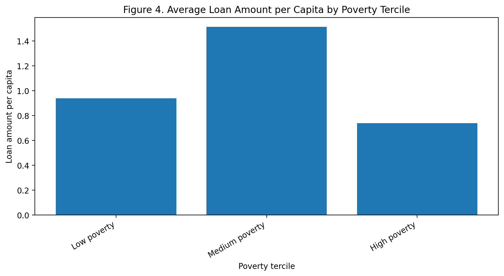

# Kiva Microfinance and Economic Development

This repository contains the data pipeline, econometric analysis, robustness checks, and paper for a study of how Kiva microfinance activity changes with economic development. The project separates three empirical questions that are often conflated: whether Kiva operates in a country, how much it lends there, and how large an individual loan is.

[Read the compiled research paper](paper/main.pdf)

## Research question

Does Kiva lending follow an inverted-U, or “middle-income peak,” as countries develop? The analysis tests that hypothesis separately at the extensive margin (country entry), quantity margin (total lending), and size margin (individual loan amount).

## Main findings

1. **Individual loan size is significantly U-shaped.** The preferred loan-level quadratic model has a positive, statistically significant quadratic term. The Lind–Mehlum test confirms that the curve turns within the observed range, and the result survives excluding the United States, adding sector fixed effects, changing the clustering level, and deflating loan size by local prices.
2. **Total lending volume does not show a statistically significant inverted-U.** The quadratic term is negative but insignificant in the country-year OLS models and in PPML specifications both with and without zero-lending country-years.
3. **Kiva entry is significantly concave, but a complete inverted-U is not formally established.** The extensive-margin Logit quadratic term is significant, as is its average marginal effect, but the Lind–Mehlum test does not confirm the required initial rise at the low end of the development range.

The results imply that country entry, total lending, and individual loan size follow different development logics.

## Data

The analysis combines:

- 917,955 Kiva loan-level records, with 913,128 observations in the preferred loan-size regression;
- World Bank indicators for GDP per capita, population, governance, institutions, and financial access;
- an 84-country panel covering 2013–2017;
- 357 country-year observations in the main Kiva-active panel; and
- a 1,020-observation global country-year panel containing 646 true zero-lending country-years.

The institutional-quality measure is a first principal component constructed from World Bank governance indicators.

Raw Kiva loan files, including `loans.csv`, are not committed because of their size. Scripts that rebuild the analytical datasets expect the required raw files under `data/`. The processed datasets used by the paper are retained under `outputs/`.

## Methods

- Country-year and loan-level OLS with country- or country-year-clustered standard errors
- PPML for total lending, including zero-lending country-years
- Logit with average marginal effects for Kiva country entry
- Lind–Mehlum intersection-union tests and Fieller confidence intervals for turning points
- PCA institutional-quality index
- Year and sector fixed effects and loan-level robustness specifications

## Repository structure

| Path | Contents |
| --- | --- |
| `paper_publication_version.ipynb` | Main executed analysis notebook |
| `analysis/` | Data construction, merging, tables, plots, and World Bank data scripts |
| `data/` | Small committed inputs and geographic reference files; raw Kiva files are excluded |
| `outputs/` | Processed panels, regression tables, and result figures |
| `paper/` | LaTeX source, compiled paper PDFs, generated tables and figures, and verification scripts |
| `BASELINE_RESULTS.md` | Record of baseline estimates |
| `DECISIONS.md` | Analysis and specification decisions |

## Reproducing the analysis

The repository does not currently include a pinned environment file or the large raw Kiva loan files, so a clean clone is not sufficient for full end-to-end reproduction.

1. Restore the required raw Kiva files under `data/`.
2. Create a Python/Jupyter environment containing the packages imported by the committed workflow: pandas, NumPy, Matplotlib, GeoPandas, Statsmodels, SciPy, IPython/Jupyter, nbformat, stargazer, wbdata, country-converter, and pycountry.
3. Open `paper_publication_version.ipynb` and run the notebook from top to bottom.
4. From the repository root, regenerate the paper tables, figures, and machine-readable key numbers with:

   ```bash
   python paper/export_assets.py
   ```

5. Cross-check the regenerated values against the stored notebook outputs with:

   ```bash
   python paper/verify_against_notebook.py
   ```

The verification report is written to `paper/ASSET_CHECK.md`. Package versions are not pinned, so numerical or rendering differences may occur across environments.

## Selected result figure

The following committed output compares loan amounts per capita across poverty terciles:



## Author

Kexing Yan · 严可行
